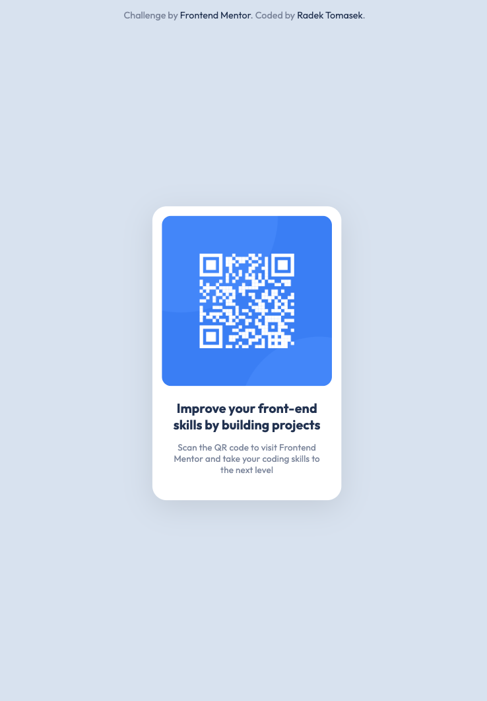
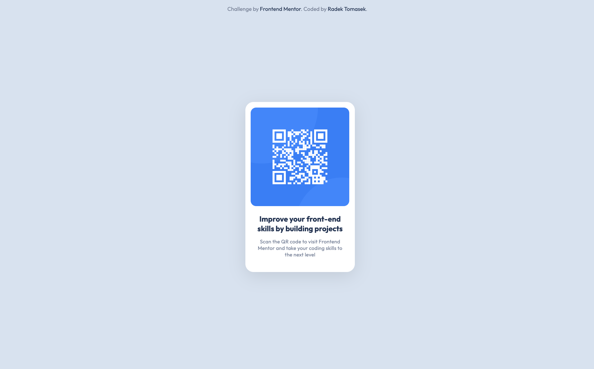

# QR Code Component

This repository contains an implementation of one of the Frontend Mentor Challenges - [QR Code Component](https://www.frontendmentor.io/challenges/qr-code-component-iux_sIO_H) using HTML/CSS.

## Overview

### The Challenge

This challenge ([QR Code Component](https://www.frontendmentor.io/challenges/qr-code-component-iux_sIO_H)) was the fifth one I picked from the [Frontend Mentor](https://www.frontendmentor.io).

I had completed the previous challenges using the [TailwindCSS](https://tailwindcss.com). It was fine and I learned quite a lot, especially using some specific configuration settings. But I think it might be a good idea to get really good at CSS in general too and I decided to start implementing these challenges in vanilla CSS too.

Therefore, this project doesn't use any special framework, just a vanilla CSS with a few CSS properties. Let's talk more about it in the next few sections.

### Screenshots

There are a few screenshots captured within the various screen sizes.

#### Mobile Version

This is the **mobile version** as displayed on **iPhone 12 Pro**.

#### Tablet Version

This is the **tablet version** as displayed on **iPad Air**.

#### Desktop Version

This is the **desktop version** as displayed on a large screen.

### Links

- Solution URL: [https://github.com/radektomasek/fm-qr-code-component](https://github.com/radektomasek/fm-qr-code-component)
- Live Site URL: [https://radektomasek.github.io/qr-code-component](https://radektomasek.github.io/qr-code-component)

## My process

Building [this challenge](https://www.frontendmentor.io/challenges/qr-code-component-iux_sIO_H) was fun. Whilst using vanilla CSS, I tried to make sure the code is clean and readable. The challenge wasn't too difficult, however.

### Built with

- Semantic HTML5 markup
- Mobile-first workflow
- [Parcel](https://parceljs.org) - a simple, zero config builder

### What I learned

The challenge wasn't too difficult in terms of complexity, but I utilized this as an opportunity to play with several variables for the Flexbox. And as a result, I learned there is a `gap` property for Flexbox (I had thought, it was available just for the `grid`).

### Continued development

Athought I used vanilla CSS at this time, I would like to use several methodologies of the CSS in the future. Cube CSS in particular.

## Author

- Frontend Mentor - [@radektomasek](https://www.frontendmentor.io/profile/radektomasek)
- Linkedin - [radektomasek](https://www.linkedin.com/in/radektomasek)
- Twitter - [@radek_tomasek](https://twitter.com/radek_tomasek)
